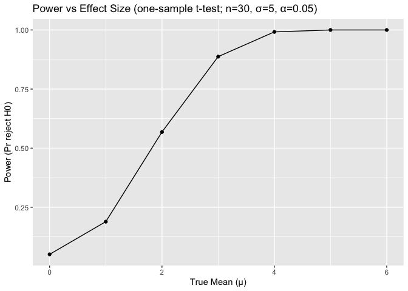
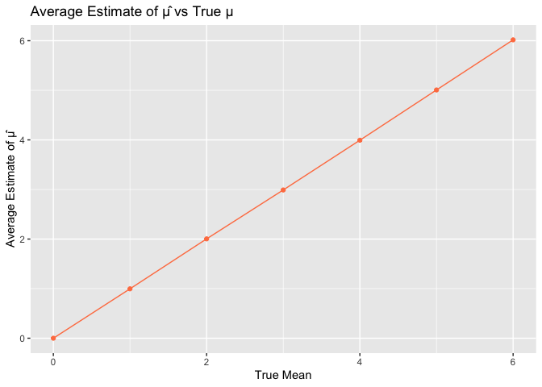
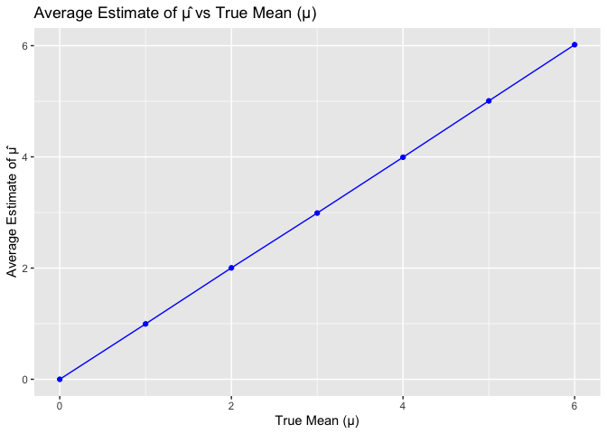
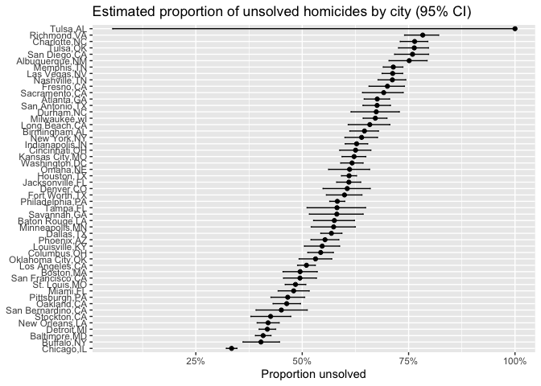

p8105_hw5_ab6169
================
Amrutha Banda
2025-11-08

``` r
library(p8105.datasets)
library(tidyverse)
```

    ## ── Attaching core tidyverse packages ──────────────────────── tidyverse 2.0.0 ──
    ## ✔ dplyr     1.1.4     ✔ readr     2.1.5
    ## ✔ forcats   1.0.0     ✔ stringr   1.5.1
    ## ✔ ggplot2   3.5.2     ✔ tibble    3.2.1
    ## ✔ lubridate 1.9.4     ✔ tidyr     1.3.1
    ## ✔ purrr     1.0.4     
    ## ── Conflicts ────────────────────────────────────────── tidyverse_conflicts() ──
    ## ✖ dplyr::filter() masks stats::filter()
    ## ✖ dplyr::lag()    masks stats::lag()
    ## ℹ Use the conflicted package (<http://conflicted.r-lib.org/>) to force all conflicts to become errors

``` r
library(broom)
library(dplyr)
library(purrr)
```

# Problem 1

``` r
birthdays = sample(1:365, 50, replace = TRUE)

repeated_bday= length(unique(birthdays)) < 50

repeated_bday
```

    ## [1] TRUE

``` r
unique(c(1,2,3,4,5,1,1,3))
```

    ## [1] 1 2 3 4 5

In a function

``` r
bday_sim= function(n_room) {
  birthdays= sample(1:365, n_room, replace = TRUE)

  repeated_bday= length(unique(birthdays)) < n_room

  repeated_bday
}

bday_sim(20)
```

    ## [1] FALSE

``` r
bday_sim_results= 
  expand_grid(
    bdays= 2:50, 
    iter= 1:10000
  ) |>  
  mutate(
    result= map_lgl(bdays, bday_sim)
  ) |> 
  group_by(
    bdays
  ) |>  
  summarize(
    prob_repeat= mean(result)
  )
```

Plot Showing the Probability as a function of group size

``` r
bday_sim_results |>
  ggplot(aes(x = bdays, y = prob_repeat)) + 
  geom_point() + 
  geom_line() +
  labs(
    x = "Group size (n)",
    y = "Probability of at least one shared birthday",
    title = "Birthday paradox via simulation (10,000 runs per n)"
  )
```

<!-- -->
Comments: This plot shows us how probability of at least two people
sharing a birthday increases as the group size grows. When there are
fewer than 10 people in the room, the probability is close to zero. This
means that having a shared birthday is very unlikely. Meanwhile, as the
group size approaches around 20-25 people, the probability rises and
reaches to about 50%. I also observed that the curve begins to flatten
after about 35 people.

# Problem 2

``` r
set.seed(1)
```

Simulating One Sample test

``` r
sim_ttest = function(mu, n = 30, sigma = 5) {
  
  x  = rnorm(n, mean = mu, sd = sigma)
  tt = t.test(x, mu = 0)
  tibble(
    mu_hat  = mean(x),
    p_value = tt$p.value,
    reject  = tt$p.value < 0.05
  )
}
```

5000 simulations

``` r
sims_df = 
  expand_grid(
    mu_true = 0:6,
    iter = 1:5000
  ) |>
  mutate(
    res = map(mu_true, ~ sim_ttest(mu = .x))
  ) |>
  unnest(res)
```

Power of the test

``` r
power_df =
  sims_df |>
  group_by(mu_true) |>
  summarize(
    power = mean(reject),
    .groups = "drop"
  )
```

Power Plot

``` r
power_df |>
  ggplot(aes(x = mu_true, y = power)) +
  geom_line() +
  geom_point() +
  labs(
    title = "Power vs Effect Size (one-sample t-test; n=30, σ=5, α=0.05)",
    x = "True Mean (μ)",
    y = "Power (Pr reject H0)"
  )
```

<!-- -->
Description: I observed that the association between effect size and
power.

Average Estimate

``` r
estimate_df =
  sims_df |>
  group_by(mu_true) |>
  summarize(
    mean_mu_hat_all    = mean(mu_hat),
    mean_mu_hat_reject = mean(mu_hat[reject]),
    .groups = "drop"
  )

estimate_df
```

    ## # A tibble: 7 × 3
    ##   mu_true mean_mu_hat_all mean_mu_hat_reject
    ##     <int>           <dbl>              <dbl>
    ## 1       0       -0.000262             0.0426
    ## 2       1        0.996                2.21  
    ## 3       2        2.00                 2.60  
    ## 4       3        2.99                 3.18  
    ## 5       4        3.99                 4.01  
    ## 6       5        5.01                 5.01  
    ## 7       6        6.02                 6.02

Plot of Average Estimate

``` r
estimate_df |>
  ggplot(aes(x = mu_true, y = mean_mu_hat_all)) +
  geom_point(color = "coral") +
  geom_line(color = "coral") +
  labs(
    title = "Average Estimate of μ̂ vs True μ",
    x = "True Mean",
    y = "Average Estimate of μ̂"
  )
```

<!-- -->

Plot: average estimate

``` r
estimate_df |>
  ggplot(aes(x = mu_true, y = mean_mu_hat_all)) +
  geom_line(color = "blue") +
  geom_point(color = "blue") +
  labs(
    title = "Average Estimate of μ̂ vs True Mean (μ)",
    x = "True Mean (μ)",
    y = "Average Estimate of μ̂"
  )
```

<!-- -->

Plot: Null Rejected

``` r
estimate_df |>
  ggplot(aes(x = mu_true, y = mean_mu_hat_reject)) +
  geom_point(color = "red") +
  geom_line(color = "red") +
  labs(
    title = "Average μ̂ (only when p < 0.05)",
    x = "True Mean (μ)",
    y = "Average Estimate of μ̂"
  )
```

<!-- -->
Comments: The sample average of μ̂ across tests for which the null is
rejected is not approximately equal to the true value of μ. I observed
that when we only include samples where the null hypothesis was rejected
(p \< 0.05), the estimated means tend to be larger than the true mean.
This is happening because we’re only keeping samples show stronger
effects than average.

# Problem 3

Load the Homicide Dataset

``` r
homicide_raw= read_csv("data/homicide-data.csv", na = c("NA", ".", "")) |> 
janitor::clean_names()
```

    ## Rows: 52179 Columns: 12
    ## ── Column specification ────────────────────────────────────────────────────────
    ## Delimiter: ","
    ## chr (9): uid, victim_last, victim_first, victim_race, victim_age, victim_sex...
    ## dbl (3): reported_date, lat, lon
    ## 
    ## ℹ Use `spec()` to retrieve the full column specification for this data.
    ## ℹ Specify the column types or set `show_col_types = FALSE` to quiet this message.

Description of Data:

``` r
unsolved_levels= c("Closed without arrest", "Closed by arrest")

homicide_data= 
  homicide_raw |>
  mutate(
    city_state = paste(city, state, sep = ","),
    unsolved   = disposition %in% unsolved_levels) |>
  group_by(city_state) |>
  mutate(
    total= n(),
    unsolved_total = sum(unsolved)) |>
  ungroup() |>
  select(-city, -state, -disposition)
```

Baltimore, MD

``` r
baltimore_df <- 
  homicide_data |> 
  filter(city_state %in% c("Baltimore, MD", "Baltimore,MD"))


baltimore_counts <- 
  baltimore_df |> 
  summarize(
    total = n(),
    unsolved = sum(unsolved, na.rm = TRUE)
  )
baltimore_counts
```

    ## # A tibble: 1 × 2
    ##   total unsolved
    ##   <int>    <int>
    ## 1  2827     1154

``` r
baltimore_test <- 
  prop.test(baltimore_counts$unsolved, baltimore_counts$total)
baltimore_test
```

    ## 
    ##  1-sample proportions test with continuity correction
    ## 
    ## data:  baltimore_counts$unsolved out of baltimore_counts$total, null probability 0.5
    ## X-squared = 94.915, df = 1, p-value < 2.2e-16
    ## alternative hypothesis: true p is not equal to 0.5
    ## 95 percent confidence interval:
    ##  0.3900496 0.4266151
    ## sample estimates:
    ##         p 
    ## 0.4082066

``` r
baltimore_tidy <- 
  broom::tidy(baltimore_test) |> 
  select(estimate, conf.low, conf.high)

baltimore_tidy
```

    ## # A tibble: 1 × 3
    ##   estimate conf.low conf.high
    ##      <dbl>    <dbl>     <dbl>
    ## 1    0.408    0.390     0.427

Plot

``` r
city_counts <- homicide_data |>
  group_by(city_state) |>
  summarize(
    total    = n(),
    unsolved = sum(unsolved, na.rm = TRUE),
    .groups = "drop"
  )

city_results <- city_counts |>
  mutate(
    test_obj = map2(unsolved, total, ~ prop.test(.x, .y)),
    tidy_out = map(test_obj, broom::tidy)
  ) |>
  unnest(tidy_out) |>
  select(city_state, total, unsolved, estimate, conf.low, conf.high)
```

    ## Warning: There was 1 warning in `mutate()`.
    ## ℹ In argument: `test_obj = map2(unsolved, total, ~prop.test(.x, .y))`.
    ## Caused by warning in `prop.test()`:
    ## ! Chi-squared approximation may be incorrect

``` r
city_results |>
  mutate(city_state = forcats::fct_reorder(city_state, estimate)) |>
  ggplot(aes(x = city_state, y = estimate)) +
  geom_point() +
  geom_errorbar(aes(ymin = conf.low, ymax = conf.high), width = 0.2) +
  coord_flip() +
  labs(
    title = "Estimated proportion of unsolved homicides by city (95% CI)",
    x = NULL,
    y = "Proportion unsolved") +
  scale_y_continuous(labels = scales::percent_format(accuracy = 1))
```

<!-- -->
