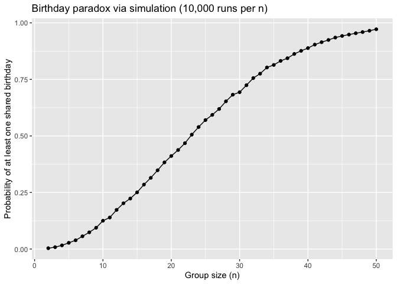

p8105_hw5_ab6169
================
Amrutha Banda
2025-11-08

``` r
library(p8105.datasets)
library(tidyverse)
```

    ## ── Attaching core tidyverse packages ──────────────────────── tidyverse 2.0.0 ──
    ## ✔ dplyr     1.1.4     ✔ readr     2.1.5
    ## ✔ forcats   1.0.0     ✔ stringr   1.5.1
    ## ✔ ggplot2   3.5.2     ✔ tibble    3.2.1
    ## ✔ lubridate 1.9.4     ✔ tidyr     1.3.1
    ## ✔ purrr     1.0.4     
    ## ── Conflicts ────────────────────────────────────────── tidyverse_conflicts() ──
    ## ✖ dplyr::filter() masks stats::filter()
    ## ✖ dplyr::lag()    masks stats::lag()
    ## ℹ Use the conflicted package (<http://conflicted.r-lib.org/>) to force all conflicts to become errors

``` r
library(broom)
library(dplyr)
```

# Problem 1

``` r
birthdays = sample(1:365, 50, replace = TRUE)

repeated_bday= length(unique(birthdays)) < 50

repeated_bday
```

    ## [1] FALSE

``` r
unique(c(1,2,3,4,5,1,1,3))
```

    ## [1] 1 2 3 4 5

In a function

``` r
bday_sim= function(n_room) {
  birthdays= sample(1:365, n_room, replace = TRUE)

  repeated_bday= length(unique(birthdays)) < n_room

  repeated_bday
}

bday_sim(20)
```

    ## [1] FALSE

``` r
bday_sim_results= 
  expand_grid(
    bdays= 2:50, 
    iter= 1:10000
  ) |>  
  mutate(
    result= map_lgl(bdays, bday_sim)
  ) |> 
  group_by(
    bdays
  ) |>  
  summarize(
    prob_repeat= mean(result)
  )
```

plot this

``` r
 bday_sim_results |>  
  ggplot(aes(x=bdays, y=prob_repeat))+ 
  geom_point() + 
  geom_line()
```

<!-- -->

# Problem 2

# Problem 3

Load the Homicide Dataset

``` r
homicide_raw= read_csv("data/homicide-data.csv", na = c("NA", ".", ""))
```

    ## Rows: 52179 Columns: 12
    ## ── Column specification ────────────────────────────────────────────────────────
    ## Delimiter: ","
    ## chr (9): uid, victim_last, victim_first, victim_race, victim_age, victim_sex...
    ## dbl (3): reported_date, lat, lon
    ## 
    ## ℹ Use `spec()` to retrieve the full column specification for this data.
    ## ℹ Specify the column types or set `show_col_types = FALSE` to quiet this message.

Description of Data:

``` r
unsolved_levels= c("Closed without arrest", "Closed by arrest")

homicide_data= 
  homicide_raw |>
  mutate(
    city_state = paste(city, state, sep = ","),
    unsolved   = disposition %in% unsolved_levels) |>
  group_by(city_state) |>
  mutate(
    total= n(),
    unsolved_total = sum(unsolved)) |>
  ungroup() |>
  select(-city, -state, -disposition)
```

Baltimore, MD

``` r
baltimore_df <- 
  homicide_data |> 
  filter(city_state %in% c("Baltimore, MD", "Baltimore,MD"))


baltimore_counts <- 
  baltimore_df |> 
  summarize(
    total = n(),
    unsolved = sum(unsolved, na.rm = TRUE)
  )
baltimore_counts
```

    ## # A tibble: 1 × 2
    ##   total unsolved
    ##   <int>    <int>
    ## 1  2827     1154

``` r
baltimore_test <- 
  prop.test(baltimore_counts$unsolved, baltimore_counts$total)
baltimore_test
```

    ## 
    ##  1-sample proportions test with continuity correction
    ## 
    ## data:  baltimore_counts$unsolved out of baltimore_counts$total, null probability 0.5
    ## X-squared = 94.915, df = 1, p-value < 2.2e-16
    ## alternative hypothesis: true p is not equal to 0.5
    ## 95 percent confidence interval:
    ##  0.3900496 0.4266151
    ## sample estimates:
    ##         p 
    ## 0.4082066

``` r
baltimore_tidy <- 
  broom::tidy(baltimore_test) |> 
  select(estimate, conf.low, conf.high)

baltimore_tidy
```

    ## # A tibble: 1 × 3
    ##   estimate conf.low conf.high
    ##      <dbl>    <dbl>     <dbl>
    ## 1    0.408    0.390     0.427
